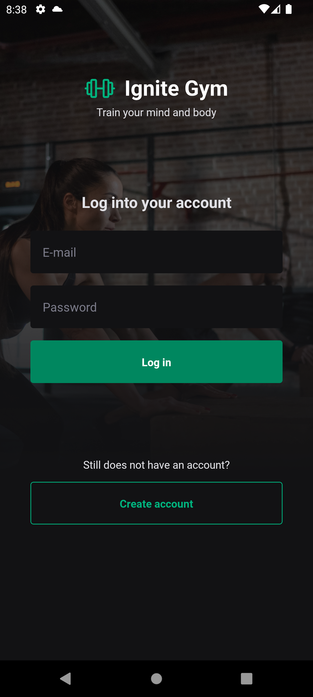
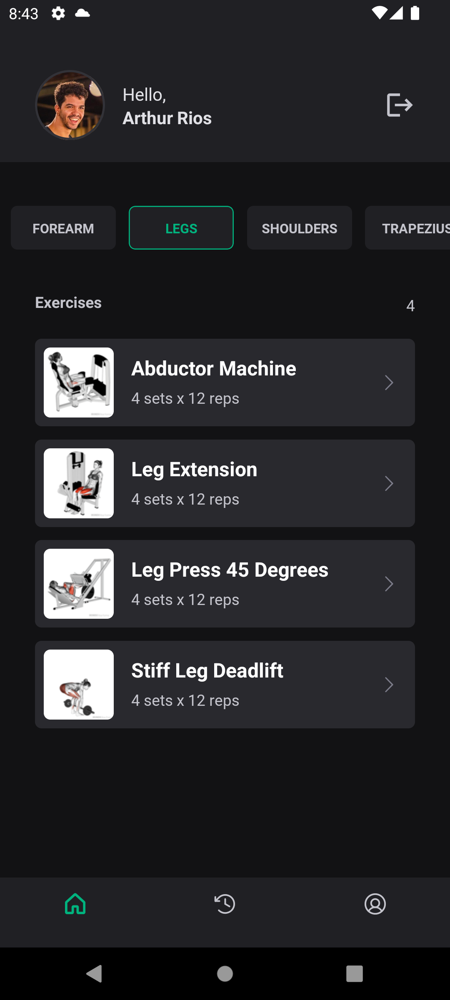
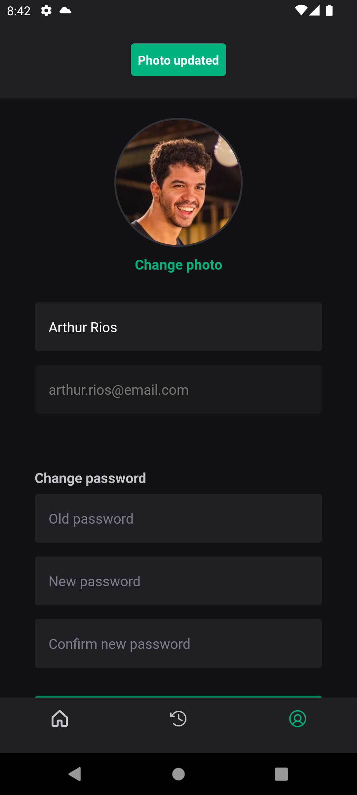
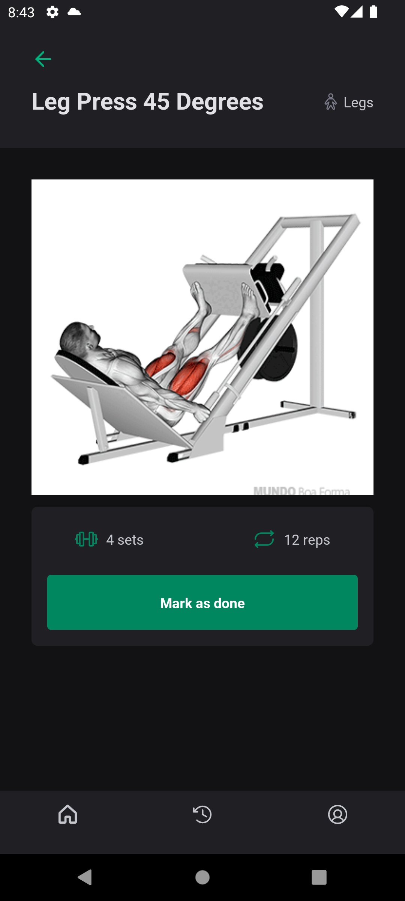
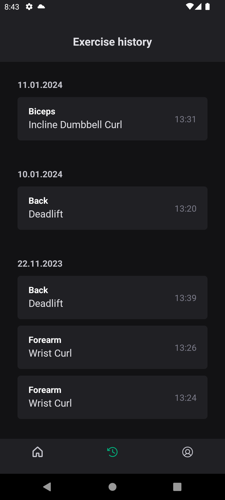

# IgniteGym 2.0
## The App
Manage your gym exercises and routine with IgniteGym. Register the exercises you've done in your history and get notified about your progress.

### Previews

  
  

  
  

  

### Techs
1. React Native
2. React
3. Typescript
4. Native Base
5. Phosphor Icons
6. React Hook Form
7. Yup
8. OneSignal

### Functions
- Add exercises to history:
- Edit profile
- Push Notifications (UserTags):
  - `days_since_last_exercise`: `'number'`
  - `exercises_done_last_week`: `'number'`
  - `is_logged_in`: `'true'` or `'false'`

### Steps
1. Clone this repository;
2. Run your preferred command to install dependencies:
- `npm install`
3. Run `npx expo prebuild` and `npx expo run:ios` or `npx expo run:android`.
4. Create `.env` with AppID Keys for ios and android. Follow model in `env.ts`.
5. Run the app with:
- `npm start`
6. Clone the backend repository and follow its steps:
[Backend](https://github.com/arthurrios/ignitegym-api)